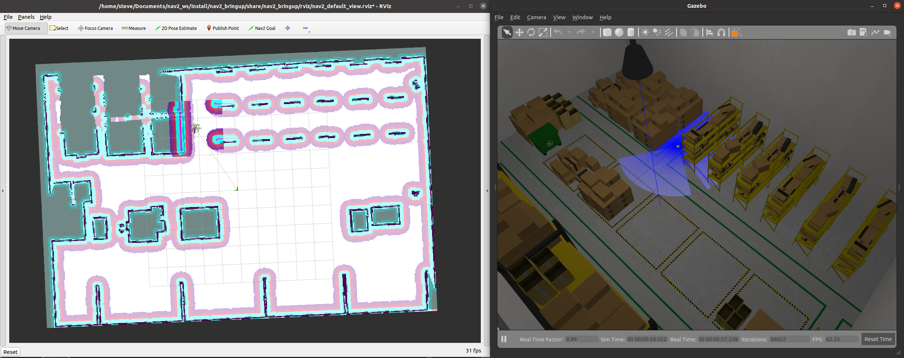

# nav2_rosdevday_2021

This project has a step-by-step tutorial for how to work with some of the most basic features of Nav2 using a Jupyter Notebook in a warehouse environment to create a basic application. This is used by the [2021 ROS Developers Day](https://www.theconstructsim.com/ros-developers-day-2021/) talk by [Steve Macenski](https://www.linkedin.com/in/steve-macenski-41a985101/).

This contains:
- A Jupyter notebook with instructions for a Nav2 walkthrough of these features
- Demo for running Nav2 in the AWS Warehouse World
- Demo for running Nav2 on a non-TB3 industrial robot
- Demo for Keepout Zones and Speed Restricted Zones
- Demo code for working with Nav2 in python3 simple autonomy application

This demonstration is overall a reasonable baseline for how to work with Nav2 with a non-default setup (e.g. non-Turtlebot3 in a non-sandbox world) for first-time users.



## Setup

To set this up on your own machine, please do the following:

``` bash
git clone git@github.com:stevemacenski/nav2_rosdevday_2021.git
mkdir -p colcon_ws/src
cd colcon_ws

vcs import src < ../deps.repos
vcs pull src

source /opt/ros/galactic/setup.bash
colcon build
```

## Running the demos

You can see step-by-steps in the `main.ipynb` file (which can be launched via `jupyter-notebook main.ipynb`). In general though after building the demos can be launched as:

``` bash
source colcon_ws/install/setup.bash
ros2 launch nav2_rosdevday_2021 system_launch.py # launches simulation, rviz, nav2

source colcon_ws/install/setup.bash
python3 colcon_ws/src/nav2_rosdevday_2021/scripts/{pick a demo}.py # launches autonomy or API demo
```

With demos being:
- `picking_demo.py`
- `security_demo.py`
- `inspection_demo.py`
- `nav_to_pose_demo.py`
- `nav_through_poses_demo.py`
- `waypoint_follower_demo.py`

The first 3 are example demo applications using Nav2 tools. The final 3 are full examples of using the `robot_navigator.py` file for python3-based Nav2-as-a-library. Each are well commented and self explanatory.
